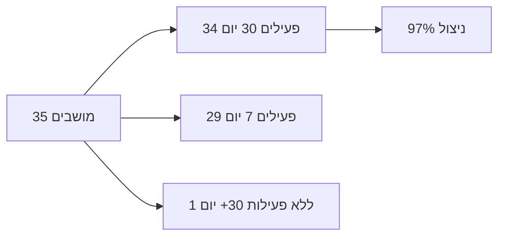

# דוח מנהלים: GitHub Copilot — מנורה (`menora-copilot`)

**מקור הנתונים:** GitHub Copilot Metrics API (ארגון `menora-copilot`, Enterprise `menora-insurance`)  
**תאריך הפקה:** 1 ביוני 2026  
**טווח שביקשת:** שנה אחורה (01/06/2025 – 01/06/2026)  
**טווח בפועל ב-API:** **19/01/2026 – 31/05/2026** (126 ימים) — Copilot הוקצה בארגון מסוף ינואר 2026; לפני כן אין היסטוריה ב-API.

---

## 1. תקציר מנהלים (Executive Summary)

| מדד | ערך |
|-----|-----|
| מושבים מוקצים | **35** |
| ניצול מושבים (פעילות ב-30 יום) | **97%** (34/35) |
| ממוצע משתמשים פעילים יומי (DAU) | **4.5** (מגמה עולה ל-**9** במאי) |
| שיא DAU | **16** (29/04/2026) |
| הצעות קוד (מצטבר) | **4,181** |
| קבלות קוד (מצטבר) | **1,078** (**25.8%**) |
| שורות קוד שאושרו (מצטבר) | **1,507** |
| סיבובי צ'אט Copilot (מצטבר) | **11,909** |
| משתמשים בדוח 28 יום | **28** |
| שלב אימוץ דומיננטי | **Code first** — **54%** מהמשתמשים בדוח |

**מסר למנהלים:** ההשקה מצליחה — קצב השימוש מזנק (במיוחד במאי), רוב המושבים בשימוש, והצוות כבר עובד בעיקר במצב "קודם" (IDE + Agent). יש פער בין עלות מושבים לבין ROI מדיד — אבל מגמת הצמיחה חיובית ויש מנוף ברור (CLI, Code Review, מושבים רדומים).

---

## 2. הקשר ארגוני

- **ארגון GitHub:** `menora-copilot`
- **Enterprise:** `menora-insurance`
- **תוכנית:** Enterprise
- **מדיניות:** הצעות קוד ציבוריות **חסומות**; IDE Chat + CLI **מופעלים**; Platform Chat **לא מוגדר**
- **ניהול מושבים:** `assign_all` (35 מושבים סה"כ)
- **מחזור חיוב נוכחי:** 23 פעילים / 12 לא פעילים במחזור (לפי Billing API)

---

## 3. אימוץ ומושבים (Adoption & Licenses)



| מדד מושבים | ערך |
|------------|-----|
| מוקצים כעת | 35 |
| פעילים ב-7 ימים | 29 |
| פעילים ב-30 ימים | 34 |
| ללא פעילות 30+ יום | 1 (`guyanmen` — מושב ללא שימוש) |
| ללא פעילות 7 ימים | 6 (הזדמנות לעידוד מחדש) |
| תאריך הקצאה ראשון | **19/01/2026** |

---

## 4. מגמת שימוש חודשית (מצטבר יומי)

| חודש | ממוצע DAU | הצעות קוד | קבלות | שיעור קבלה | שורות שאושרו | סיבובי צ'אט |
|------|-----------|-----------|-------|------------|--------------|-------------|
| ינו' 26 | 2 | 34 | 4 | 11.8% | 4 | 96 |
| פבר' 26 | 2 | 113 | 19 | 16.8% | 28 | 321 |
| מרץ 26 | 3 | 580 | 169 | 29.1% | 250 | 991 |
| אפר' 26 | 5 | 762 | 213 | 28.0% | 289 | 3,634 |
| מאי 26 | **9** | **2,692** | **673** | 25.0% | **936** | **6,867** |

**תובנה:** עקומת אימוץ קלאסית — התייצבות, אחר כך קפיצה; במאי כמעט **פי 5** ב-DAU לעומת ינואר.

---

## 5. פרודוקטיביות ואיכות (28 יום אחרונים)

| מדד | ערך |
|-----|-----|
| שיעור קבלה (לפי ספירה) | **25.4%** |
| שיעור קבלה (לפי שורות) | **29.7%** |
| סה"כ הצעות (28 יום) | **2,616** |
| שורות שהוצעו (28 יום) | **3,118** |
| אינטראקציות (28 יום, דוח משתמשים) | **6,219** |
| יצירות קוד (28 יום) | **9,888** |
| קבלות (28 יום) | **821** |
| שורות שנוספו (28 יום, דוח משתמשים) | **72,059** |

> **הערה:** ספירת "שורות שנוספו" בדוח המשתמשים (חלון 28 יום) גבוהה מהסכום היומי המצטבר — מדדים שונים של GitHub. למצגת: הציגו את שניהם עם תווית "28 יום" / "מצטבר מתאריך השקה".

---

## 6. שלבי אימוץ AI (Adoption Phases)

GitHub מסווג משתמשים לפי שימוש ב-28 יום (≥2 ימים פעילים):

| שלב | משמעות | משתמשים | % |
|-----|--------|---------|---|
| 0 — ללא cohort | לא עמד בקריטריון מעורבות | 0 | 0% |
| **1 — Code first** | IDE, השלמות, Agent בעורך | **15** | **53.6%** |
| 2 — Agent first | סוכן בענן / review / CLI | 0 | 0% |
| 3 — Multi-agent | מספר משטחי סוכן | 0 | 0% |

**שימוש ביכולות (28 יום, 28 משתמשים בדוח):**

| יכולת | משתמשים |
|--------|---------|
| Agent | 28 (100%) |
| Chat | 28 (100%) |
| CLI | **0** |
| Code Review | **0** |

**מסר:** הצוות "רוכב" על Copilot בעורך ובצ'אט; **לא נפתחו** עדיין CLI ו-Code Review — הזדמנות להעלאת ROI בשלב הבא.

---

## 7. מובילי שימוש (Top 10, חלון 28 יום)

| # | משתמש | שורות שנוספו | קבלות | אינטראקציות | שלב |
|---|--------|--------------|-------|-------------|-----|
| 1 | Talhayo | 14,153 | 4 | 159 | Code first |
| 2 | guyt-mnr | 8,998 | 0 | 615 | Code first |
| 3 | ag936 | 8,541 | 51 | 400 | — |
| 4 | dmitrylilmivt | 8,308 | 74 | 533 | — |
| 5 | hgmenor | 7,690 | 11 | 1,186 | Code first |
| 6 | edwardkes | 4,775 | 52 | 984 | Code first |
| 7 | yosef-albo | 3,995 | 56 | 699 | Code first |
| 8 | Barleme | 2,705 | 19 | 170 | Code first |
| 9 | avigam1 | 2,278 | 107 | 73 | Code first |
| 10 | dinemenoramivt | 2,209 | 297 | 95 | Code first |

**תובנה:** כ-10 משתמשים נושאים את רוב הערך; מומלץ לזהות אותם כ-"Copilot Champions" להרחבת שיטות עבודה.

---

## 8. טכנולוגיה וכלים

**שפות מובילות (שורות שאושרו, מצטבר):**

1. TypeScript — 601
2. JavaScript — 433
3. TSX — 222
4. Python — 89
5. SQL — 18

**עורכים:** כמעט כל הפעילות ב-**VS Code** (1,312 קבלות מצטברות).

**מסר:** התאמה טובה לסטאק Web/TS של הארגון; IntelliJ כמעט לא בשימוש — לשקול הדרכה אם רלוונטי.

---

## 9. ROI (הערכה לצורך מצגת)

> **חשוב:** ROI אמיתי דורש כיול מול שכר מפתח, עלות מושב בפועל, וזמן חיסכון לפעולה. להלן מודל שמרני להצגה.

### מודל A — שמרני (מבוסס שורות שאושרו מצטבר: 1,507)

| הנחה | ערך |
|------|-----|
| דקות חיסכון לשורה שאושרה | 2 |
| שעות פיתוח שנחסכו | **~50 שעות** |
| עלות שעת מפתח (₪) | 250 |
| **ערך מוערך (₪)** | **~12,500** |
| עלות רישיונות משוערת (~35×$39×5 חודשים×3.7) | **~25,000 ₪** |
| **יחס ערך/עלות (שמרני)** | **~0.5×** |

### מודל B — אופטימי (מבוסס 72K שורות ב-28 יום — לא לסכום שנה!)

| ערך מוערך (2 דק'/שורה, ₪250/שעה) | **~600,000 ₪** לחלון 28 יום בלבד |

**מסר ROI למנהלים:**

- בתקופת ההשקה (כ-4.5 חודשים) המספרים השמרניים עדיין "מתחת לעלות" — **נורמלי בשלב Early Adoption**.
- **מאי 2026** מראה מסלול להחזר: DAU×2, צ'אט×7, הצעות×4 לעומת אפריל.
- עם הרחבת CLI, Code Review ו-Agent — פוטנציאל ROI גבוה משמעותית.

---

## 10. סיכונים והזדמנויות

| נושא | פעולה מומלצת |
|------|--------------|
| 1 מושב ללא שימוש (`guyanmen`) | ביטול/העברה |
| 6 משתמשים ללא פעילות 7 יום | קמפיין "חזרה ל-Copilot" |
| 0% ב-Agent first / Multi-agent | הדרכת Agent + שימוש ב-PR review |
| CLI = 0 | פיילוט CLI ל-DevOps / אוטומציה |
| פער org rollup vs דוח משתמשים | להסביר במצגת — מדדים שונים של GitHub |
| נתונים לפני 19/01/2026 | לא קיימים ב-API — לא לטעון "שנה מלאה" |

---

## 11. המלצות אסטרטגיות (2026 H2)

1. **יעד DAU:** מ-9 (מאי) ל-15+ עד סוף Q3.
2. **תוכנית Champions:** 10 המובילים מלמדים צוותים.
3. **הרחבת משטחים:** CLI + Copilot Code Review (מדידה בדוח הבא).
4. **דשבורד חודשי:** אותו לוח (`Copilot Metrics Viewer`) עם טווח מתאריך השקה.
5. **KPI למנהלים:** ניצול מושבים ≥95%, % Code first → Agent first, שורות/מפתח/חודש.

---

## 12. נספח: מקורות וצילומי מסך

### APIs שנקראו

- `GET /api/metrics` — מדדים יומיים מצטברים (126 ימים)
- `GET /api/usage-insights` — דוח משתמשים 28 יום + שלבי אימוץ
- `GET /api/seats` — מושבים והקצאות
- `GET /api/billing` — מדיניות ומחזור חיוב

### פרמטרי שאילתה

```
since=2026-01-19
until=2026-06-01
githubOrg=menora-copilot
githubEnt=menora-insurance
scope=organization
```

### צילומי מסך מהדשבורד

| קובץ | תיאור |
|------|--------|
| `docs/exec-dashboard-org-20260601-145928.png` | לשונית ארגון + אימוץ AI |
| `docs/exec-dashboard-users-20260601-150010.png` | לשונית משתמשים |
| `docs/exec-dashboard-seats-20260601-150023.png` | ניתוח מושבים |

### מבנה מוצע למצגת PowerPoint (12 שקופיות)

1. כותרת + תקציר
2. למה Copilot / יעדי העסק
3. מושבים וניצול
4. מגמה חודשית (גרף מהטבלה בסעיף 4)
5. KPI 28 יום
6. שלבי אימוץ AI
7. Top users (ללא שמות מלאים אם רגיש — אפשר רק תפקידים)
8. שפות ו-IDE
9. ROI (מודל A + מגמה)
10. סיכונים
11. תוכנית עבודה
12. Q&A + נספח

---

## אבטחה

אל תכלול קובץ `.env` או PAT במצגת או ב-git. אם טוקן GitHub נחשף — **סובבו (rotate) את הטוקן** ב-GitHub.

---

*נוצר אוטומטית מנתוני GitHub Copilot Metrics API ומלוח Copilot Metrics Viewer.*
