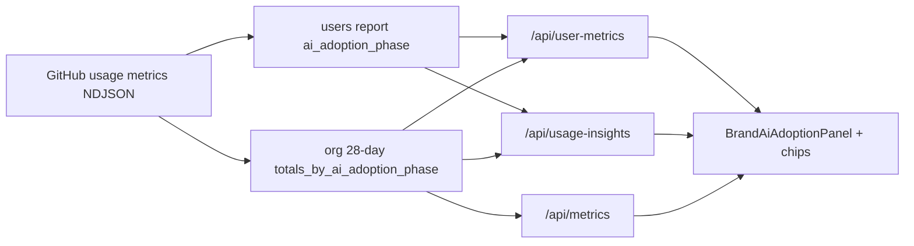

# קוהורטות AI adoption (AI adoption cohorts)

תכונה חדשה ב-[Copilot usage metrics API](https://github.blog/changelog/2026-05-29-copilot-usage-metrics-api-adds-cohorts-for-ai-adoption/) (מאי 2026). הלוח **Copilot Metrics Viewer** יכול להציג אותה בלשוניות הרלוונטיות — **מוסתר כברירת מחדל**.

## הצגה / הסתרה (`NUXT_PUBLIC_SHOW_AI_ADOPTION_COHORTS`)

| ערך | התנהגות |
|-----|----------|
| **לא מוגדר / `false`** (ברירת מחדל) | אין פאנל קוהורטות, אין צ'יפ שלב בדיאלוג משתמש, אין הסברי adoption בטבלאות |
| **`true`** | מוצגים פאנל **קוהורטות AI adoption**, צ'יפים, והערות leaderboard |

```bash
# להציג שוב (למשל כשמשתמשים גם ב-CLI, cloud agent, code review):
NUXT_PUBLIC_SHOW_AI_ADOPTION_COHORTS=true
```

אחרי שינוי — הפעלה מחדש של `npm run dev` או פריסה מחדש.

:::tip ארגון עם Copilot ב-IDE בלבד
אם אתם משתמשים רק ב-Copilot בעורך, אפשר להשאיר `false`. דפוסי שימוש ומדדי המשתמש בטבלה מספיקים לרוב. כשתפעילו cohorts, שקלו גם `NUXT_PUBLIC_ADOPTION_IDE_ONLY=true` (ראו למטה).
:::

## למה זה קיים

עד עכשיו קל היה לראות *כמה* מפתחים פעילים ב-Copilot. קשה יותר היה לענות על:

- האם הם משתמשים בעיקר בהשלמות קוד, או כבר עברו לסוכנים?
- כמה משתמשים נמצאים בשלב «סוכן יחיד» לעומת «רב-סוכנים»?
- האם ממוצעי האינטראקציות / קבלת קוד / PR שונים בין שלבי אימוץ?

GitHub מסווג כל משתמש **מעורב** לשלב אחד (0–3) לפי אילו משטחי Copilot נוצלו ב**לפחות שני ימים** בחלון **28 יום** מתגלגל. בדוחות ארגון/Enterprise מוחזרים גם **ממוצעים לפי שלב** (לא סכומים).

## איך GitHub מגדיר את השלבים

| שלב | שם באפליקציה | קריטריון (לפי GitHub) |
|-----|----------------|------------------------|
| **0** | No cohort / ללא קוהורט | המשתמש לא עמד בקריטריון המעורבות לשום שלב |
| **1** | Code first | השלמות קוד ו/או **IDE agent mode** |
| **2** | Agent first | משטח סוכן **אחד** מבוסס GitHub: Copilot cloud agent, Copilot code review, או Copilot CLI |
| **3** | Multi-agent | **שני משטחי סוכן ומעלה**, או שימוש ב-**GitHub Copilot app** |

### מצב IDE בלבד (`NUXT_PUBLIC_ADOPTION_IDE_ONLY=true`)

חל רק כש-`NUXT_PUBLIC_SHOW_AI_ADOPTION_COHORTS=true`.

כשהארגון **לא** משתמש במשטחים מחוץ לעורך (אין CLI, cloud agent, code review וכו׳), הגדירו:

```bash
NUXT_PUBLIC_ADOPTION_IDE_ONLY=true
```

ואז הלוח:

- מציג בפאנל האימוץ רק **ללא cohort** ו-**Code first** (בלי כרטיסי Agent first / Multi-agent).
- מעדכן רמזים ועמודות — בלי להזכיר סולמות שלא רלוונטיים.
- אם GitHub עדיין מסווג משתמש לשלב 2/3, בעמודת השלב מופיע **«לא רלוונטי»** (לא תווית סוכן).

ברירת מחדל: `false` (כל ארבעת השלבים מוצגים).

### שדה `version`

לכל סיווג (`ai_adoption_phase`) GitHub מוסיף `version` (מתחיל ב-`v1`) כדי שאפשר יהיה לשנות לוגיקת סיווג בעתיד בלי לאבד הקשר היסטורי. הלוח מציג את הגרסה בדיאלוג פירוט המשתמש.

### ממוצעים מול סכומים

במערך `totals_by_ai_adoption_phase` כל מדד מוצג כ-**ממוצע למשתמש** בתוך השלב (engaged users), לא כסכום כולל של כל הפעילות בארגון.

## מה זה Code first?

**Code first** (שלב 1) הוא **תווית אימוץ של GitHub**, לא סיסמה כללית ל«קוד לפני הכל». המשתמש סווג כך אם היה **מעורב** ב:

- **השלמות קוד** ב-IDE, ו/או  
- **מצב סוכן ב-IDE (IDE agent mode)**  

ב**לפחות שני ימים** ב-28 הימים האחרונים, **בלי** לעמוד בקריטריון של שלב 2 או 3.

בפועל: הוא משתמש ב-Copilot בעיקר **בתוך העורך** לכתיבת קוד, ועדיין לא עבר לשימוש עקבי בסוכני GitHub (cloud agent, code review, CLI) או בשילוב כמה סוכנים. בלוח — **ריחוף על הצ'יפ** «Code first» מציג הסבר זה.

## מה הלוח מציג (כש-`NUXT_PUBLIC_SHOW_AI_ADOPTION_COHORTS=true`)

### 1. פאנל «קוהורטות AI adoption» (`BrandAiAdoptionPanel`)

מופיע ב:

- **Organization**
- **Users**
- **Usage & billing**
- **Usage insights**


| רכיב UI | תיאור |
|---------|--------|
| **4 כרטיסי KPI** | מספר משתמשים מעורבים (`total_engaged_users`) בכל שלב 0–3 |
| **גרף עמודות** | אותם מספרים לפי שלב (שלב 0 מוצג רק אם יש מעורבים בו) |
| **טבלת Cohort averages** | ממוצעים לפי שלב — [טבלת עמודות](#טבלת-ממוצעים-לפי-cohort) |

הפאנל **מוסתר** אם אין אף משתמש מעורב בשלב כלשהו (אין נתוני cohort בדוח).

### טבלת ממוצעים לפי cohort

`BrandAiAdoptionPanel` — שורה לכל שלב (0–3). ערכים הם **ממוצעים למשתמש** בשלב, לא סכומים.

| עמודה | מפתח | הסבר |
|--------|------|------|
| **שלב** | `phase` | שלב 0–3 (למשל Code first) |
| **משתמשים מעורבים** | `engagedUsers` | `total_engaged_users` בשלב |
| **בדוח משתמשים** *(מותנה)* | `labeledUsers` | כשמוצגות שתי מדדי cohort + דוח |
| **ממוצע אינטראקציות** | `avgInteractions` | ממוצע לאורך משתמשי השלב |
| **ממוצע יצירות** | `avgGenerations` | ממוצע generations |
| **ממוצע קבלות** | `avgAcceptances` | ממוצע acceptances |
| **ממוצע שורות שנוספו** | `avgLocAdded` | ממוצע LoC added |
| **ממוצע שורות שנמחקו** | `avgLocDeleted` | ממוצע LoC deleted |
| **ממוצע PR שנוצרו** | `avgPrCreated` | ממוצע PR created |
| **ממוצע PR שמוזגו** | `avgPrMerged` | ממוצע PR merged |
| **ממוצע PR שנסקרו** | `avgPrReviewed` | ממוצע PR reviewed |
| **ממוצע חציון דקות למיזוג** | `medianMinutesToMerge` | מדד זמן מיזוג |

מפתחות: `adoption.col*`.

### 2. שלב AI adoption — דיאלוג (לא עמודה בטבלה)


בגרסה הנוכחית **אין** עמודת «שלב AI adoption» בטבלאות Users או Usage & billing. השלב מוצג ב:

| מיקום | תצוגה |
|--------|--------|
| [דיאלוג פירוט משתמש](./user-usage-detail-dialog) | צ'יפ `ai_adoption_phase` + `version` בכותרת |
| באנר מידע מעל טבלת Users | הסבר על cohort (כש-`SHOW_AI_ADOPTION_COHORTS=true`) |

צ'יפ: `BrandAiAdoptionPhaseChip` — אפור (0), סגול (1), טורקיז (2), הדגשה (3).

### 3. דיאלוג פירוט משתמש


פתיחה: **Usage & billing** → **Usage** (או לחיצה על שם המשתמש).

- צ'יפ שלב + **גרסת סיווג** (`Classification version: v1`)

## מיפוי שדות API → לוח

### רמת משתמש (`users-1-day` / `users-28-day`)

```json
"ai_adoption_phase": { "phase": 1, "version": "v1" }
```

| יכולת | סטטוס בלוח |
|--------|-------------|
| קריאת `ai_adoption_phase` מ-NDJSON | ✅ |
| תמיכה ב-`phase` מספרי או מחרוזת (`code_first`, `multi_agent`, …) | ✅ |
| צ'יפ + מיון בעמודת Users | ✅ |
| שמירת שלב בייצוא API response (JSON גולמי) | ✅ (השדה בדוח) |
| עמודת שלב בייצוא CSV של metrics הישן | ❌ לא מיושם |

### רמת ארגון / Enterprise (`organization-28-day/latest` ודומה)

מערך `totals_by_ai_adoption_phase[]`:

| שדה API (דוגמה) | עמודה בטבלת הלוח | סטטוס |
|------------------|-------------------|--------|
| `phase`, `version` | שלב (צ'יפ) | ✅ |
| `total_engaged_users` | Engaged users + KPI + גרף | ✅ |
| `user_initiated_interaction_count_avg` | ממוצע אינטראקציות | ✅ |
| `code_generation_activity_count_avg` | ממוצע generations | ✅ |
| `code_acceptance_activity_count_avg` | ממוצע acceptances | ✅ |
| `loc_added_sum_avg` | ממוצע שורות שנוספו | ✅ |
| `loc_deleted_sum_avg` | ממוצע שורות שנמחקו | ✅ |
| `pull_requests.total_created_avg` | ממוצע PR שנוצרו | ✅ |
| `pull_requests.total_merged_avg` | ממוצע PR שמוזגו | ✅ |
| `pull_requests.total_reviewed_avg` | ממוצע PR שנסקרו | ✅ |
| `pull_requests.median_minutes_to_merge_avg` | ממוצע חציון דקות למיזוג | ✅ |

הממיר ב-`shared/utils/ai-adoption-phase.ts` מחפש גם שמות חלופיים (`engaged_users`, `*_avg` ללא סיומת, וכו').

### מצב גיבוי (fallback)

אם דוח ה-28 יום של הארגון **אינו** מכיל `totals_by_ai_adoption_phase`:

- הפאנל ב-**Users** / **Usage insights** בונה תצוגה מ-**ספירת משתמשים** לפי `ai_adoption_phase` בדוח המשתמשים.
- **ממוצעי cohort** יוצגו כ-`—` (אפס בנתונים) עד ש-GitHub יחזיר את מערך הארגון.

ב-**Organization** (`/api/metrics`) אין רשימת משתמשים — רק rollup ארגוני; בלי מערך הארגון הפאנל לא יופיע.

## זרימת נתונים בשרת



| Endpoint | מקור cohort |
|----------|-------------|
| `GET /api/metrics` | `fetch28DayAdoptionPhases` → org rollup בלבד |
| `GET /api/user-metrics` | org rollup; אם ריק → `buildAdoptionPhaseView([], users)` |
| `GET /api/usage-insights` | אותו דבר + משתמשים ל-leaderboard |

## סינון משתמש ב-Usage & billing

כשמסננים לפי משתמש אחד, הפאנל מתעדכן ל-**ספירת השלב של אותו משתמש** (לא ממוצעי הארגון המלאים).

## מגבלות ידועות (חשוב)

| נושא | מצב |
|------|-----|
| **Team scope** ב-`/api/user-metrics` | לא נתמך (422) — cohort ברמת ארגון/Enterprise בלבד |
| **סינון Teams** של GitHub בדוחות | הלוח לא שולח פרמטר team ל-API adoption; שימוש ב-Teams filter של GitHub דורש הרחבה עתידית |
| **מעקב התקדמות לאורך זמן** (מעבר שלב 1→3) | לא מיושם — רק snapshot של חלון 28 הימים הנוכחי |
| **ייצוא CSV** מלשונית API response | השדה קיים ב-JSON הגולמי; אין עמודה ייעודית ב-CSV הישן של metrics |
| **Copilot Chat / Seat analysis** | אין פאנל cohort (לא רלוונטי לדוחות אלה) |

## דרישות גישה

- מנהל Enterprise או בעלים של Organization עם גישה ל-**Copilot usage metrics** דרך REST API (כמו שאר דוחות הלוח).
- אסימון / OAuth עם scopes מתאימים — ראו [Scopes](../../reference/scopes).

## קוד רלוונטי

| קובץ | תפקיד |
|------|--------|
| `shared/utils/ai-adoption-phase.ts` | פרסור, מיפוי, fallback |
| `shared/utils/usage-metrics-report.ts` | `fetch28DayRollupRecord`, `fetch28DayAdoptionPhases` |
| `app/components/BrandAiAdoptionPanel.vue` | פאנל KPI + גרף + טבלה |
| `app/components/BrandAiAdoptionPhaseChip.vue` | צ'יפ שלב |
| `tests/ai-adoption-phase.spec.ts` | בדיקות יחידה |

## קישורים

- [Organization — KPI ותרשימים](./organization-metrics)
- [עמודות Users](./users-table-columns)
- [דיאלוג פירוט משתמש](./user-usage-detail-dialog)
- [שינויים אחרונים](../../reference/recent-features)
