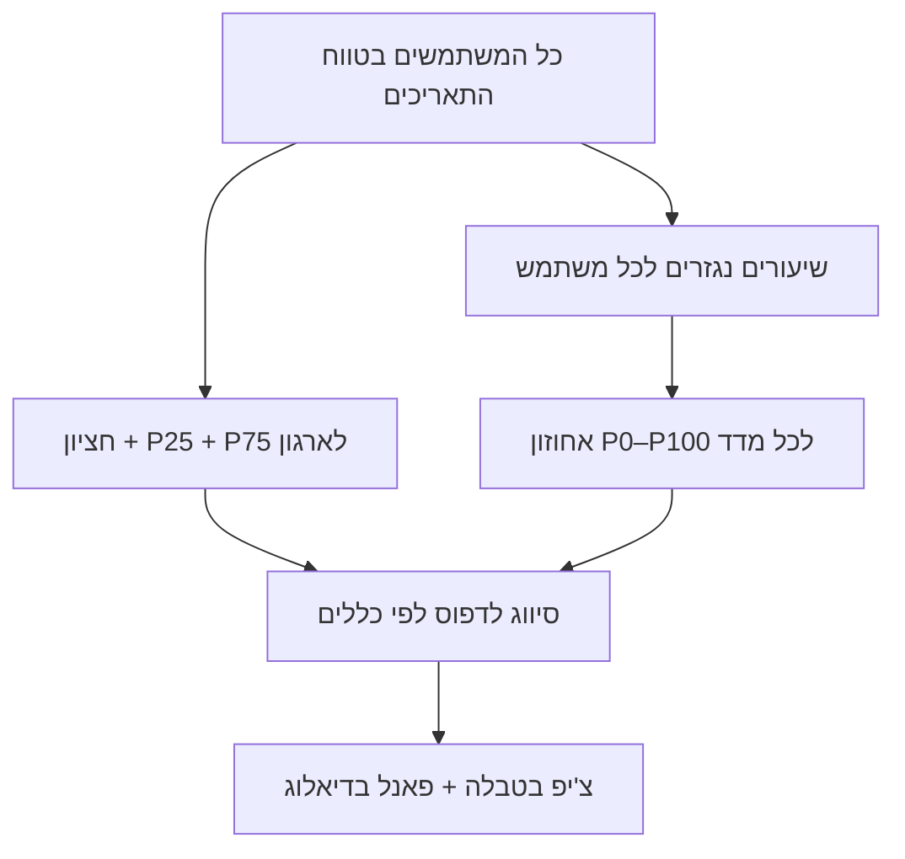

# דפוסי שימוש (Usage patterns)

**דפוסי שימוש** הם תוויות היוריסטיות שמסייעות להבין *איך* מפתח משתמש ב-Copilot — לא רק *כמה*. הן מחושבות **בלוח** על בסיס מדדי Copilot metrics (אינטראקציות, יצירות, קבלות, שורות קוד) **בהשוואה לשאר המשתמשים** בטווח התאריכים שנבחר.

:::caution לא שדה מ-GitHub
דפוסי שימוש **אינם** חלק מ-API של GitHub. הם נועדו לאימון, הכוונה ושיח פנימי — **לא** לדירוג ביצועים או להחלטות HR.
:::

## איפה רואים את זה

| מיקום | מה מוצג |
|--------|---------|
| **Users** — **5 המובילים בשימוש יעיל** | עד 5 כרטיסי KPI: לוגין, **ציון יעילות**, פעילות, דפוס — [לשונית Users](./users) |
| **Users** — עמודה **דפוס שימוש** | צ'יפ צבעוני לכל משתמש |
| **Usage & billing** — עמודה **דפוס שימוש** | אותו צ'יפ בלוח המובילים |
| **דיאלוג שימוש** (כפתור **שימוש**) | פאנל מלא: דפוס, ציון מעורבות, שיעורים נגזרים, נוסחאות, אחוזונים מול הארגון |

ריחוף על הצ'יפ בטבלה מציג הסבר קצר, רמת **ביטחון** ו**ציון מעורבות**. לפירוט מלא — פתחו את דיאלוג **שימוש**.

ראו גם: [דיאלוג פירוט משתמש](./ui-reference/user-usage-detail-dialog) · [עמודות Users](./ui-reference/users-table-columns)

## איך זה מחושב (בקצרה)

1. **קוהורט (cohort)** — כל המשתמשים שמופיעים בדוח בטווח הנבחר (לא רק השורה שמסננים אליה).
2. **ספירות גולמיות** — מהדוח: אינטראקציות, יצירות (generations), קבלות (acceptances), שורות שנוספו (LoC added).
3. **שיעורים נגזרים** — יחסים בין הספירות (ראו טבלה למטה).
4. **אחוזוני ארגון** — P25, חציון (P50), P75 על כל מדד בקוהורט.
5. **אחוזון משתמש** — «`P{n}` מול הארגון»: אחוז המשתמשים בקוהורט עם ערך **נמוך יותר** (0 = הכי נמוך, 100 = הכי גבוה).
6. **סיווג דפוס** — כללי השוואה ל-P25/P50/P75 (ראו [רשימת דפוסים](#רשימת-דפוסים)).
7. **ציון מעורבות** — 0–100: פעילות המשתמש (אינטראקציות + יצירות + קבלות) ביחס למשתמש הפעיל ביותר בקוהורט.
8. **רמת ביטחון** — נמוך / בינוני / גבוה לפי סך הפעילות (פחות נתונים → ביטחון נמוך).

## שיעורים נגזרים ונוסחאות

| מדד | נוסחה | פרשנות |
|-----|--------|---------|
| **שיעור קבלה** (Acceptance rate) | `קבלות ÷ יצירות × 100` | כמה מההצעות נשמרו (0% אם אין יצירות) |
| **יצירות לאינטראקציה** | `יצירות ÷ אינטראקציות` | כמה generations לכל «סיבוב» אינטראקציה |
| **שורות לקבלה** | `שורות שנוספו ÷ קבלות` | נפח קוד ממוצע לכל קבלה |
| **שורות לאינטראקציה** | `שורות שנוספו ÷ אינטראקציות` | LoC «יעילות» לכל אינטראקציה |
| **שורות ליצירה** | `שורות שנוספו ÷ יצירות` | LoC ממוצע לכל generation |

בדיאלוג **שימוש**, לכל שורה מוצגים: **הערך שלך**, **חציון הארגון**, **אחוזון מול הארגון**, ו**נוסחת החישוב**.

## מה כל תווית אומרת (בפשטות)

הטבלה הבאה מסבירה **בשפה יומיומית** מה רואים על המסך.  
«גבוה» / «נמוך» = **בהשוואה לשאר המשתמשים בארגון** באותו טווח תאריכים — לא מספר קבוע.

| תווית בלוח (עברית) | שם באנגלית (קוד) | במילים פשוטות | מה זה **לא** |
|--------------------|------------------|---------------|--------------|
| **נתונים לא מספיקים** | Insufficient data | עדיין מעט מדי שימוש — המערכת לא מסווגת בביטחון | לא «משתמש גרוע» |
| **שימוש חלש** | Underuse | כמעט לא משתמש ב-Copilot (מושב רדום) | לא בהכרח חסימה טכנית — כדאי לבדוק |
| **משתמש קל** | Light user | משתמש קצת, אבל פחות מרוב העמיתים | לא אותו דבר כמו «שימוש חלש» — יש פעילות |
| **מקבל סלקטיבי** | Selective accepter | אומר «כן» להצעות לעיתים קרובות, אבל **בכמות קטנה** — בוחר בזהירות | לא אומר שהוא מסרב ל-Copilot |
| **השלמת קוד תחילה** | Completion-first | עובד בעיקר עם **השלמות בשורה** (Tab), פחות צ'אט | לא אומר שלא משתמש ב-Copilot |
| **סוקר פעיל** | Active reviewer | Copilot מציע הרבה; הוא **בודק** הרבה ו**שומר מעט** | לא אומר שהוא לא מנסה — אולי ההצעות לא מתאימות |
| **מאמץ יעיל** | Efficient adopter | שומר הרבה ממה שמוצע **ביחס לארגון**, בנפח סביר — התאמה טובה | לא «הכי הרבה שורות» |
| **אימוץ נרחב** | Volume adopter | **שומר הרבה** הצעות **ו**מוסיף **הרבה שורות** — בין המשתמשים הכבדים בארגון | **לא** ציון איכות קוד; **לא** «המפתח הטוב ביותר» |
| **הרבה ניסיונות, מעט שמירה** | High try, low keep | Copilot מייצר הרבה; הוא **מנסה הרבה** אבל **שומר מעט** | שונה מ**אימוץ נרחב** — שם גם השמירה גבוהה |
| **משתמש כוח** | Power user | שימוש כבד **וגם** Chat או Agent — כמה משטחי Copilot | מועמד ל-champion, לא דירוג ביצועים |
| **מאוזן** | Balanced | תמהיל שימוש **רגיל** ביחס לארגון — באמצע החבילה | לא «ממוצע משעמם» — פשוט אין דפוס קיצוני |

:::info אימוץ נרחב (לשעבר «מאמץ בנפח»)
תרגום ישן **«מאמץ בנפח»** היה מבלבל. המשמעות: **משתמש שמאמץ הרבה מ-Copilot בכמות** — מקבל ושומר הרבה הצעות ומוסיף הרבה קוד, **מעל רוב העמיתים** באותו תקופה.
:::

## רשימת דפוסים (טכני)

| דפוס (עברית) | מתי מופיע (תמצית) | מה זה אומר בפועל |
|--------------|-------------------|-------------------|
| **נתונים לא מספיקים** | מעט מאוד פעילות ו-LoC | לא ניתן לסווג בביטחון — המתינו לעוד שימוש בטווח |
| **שימוש חלש** | אינטראקציות, יצירות ו-LoC נמוכים מ-P25 | המושב כמעט לא בשימוש — שווה בדיקת הכשרה / חסמים |
| **משתמש קל** | פעילות מתחת לחציוני הארגון | יש שימוש, אך מתחת לנפח טיפוסי |
| **מקבל סלקטיבי** | שיעור קבלה גבוה (≥ P75), נפח נמוך יחסית | מקבל מעט הצעות, אך בוחר היטב |
| **השלמת קוד תחילה** | LoC גבוה לאינטראקציה, פחות צ'אט | דומיננטיות של inline completions |
| **סוקר פעיל** | הרבה אינטראקציות, קבלה נמוכה | בודק הרבה הצעות לפני שמירה |
| **מאמץ יעיל** | קבלה גבוהה + נפח יצירות סביר | התאמה טובה בין הצעות Copilot לסגנון העבודה |
| **אימוץ נרחב** | LoC מעל P75 וקבלות ≥ חציון | שומר הרבה ומוסיף הרבה קוד — אימוץ כבד בכמות |
| **הרבה ניסיונות, מעט שמירה** | יצירות ו-LoC גבוהים, קבלה ≤ P25 | הרבה trials, מעט keeps — אולי צריך הנחיות או מודל אחר |
| **משתמש כוח** | יצירות ו-LoC גבוהים + Agent או Chat | שימוש עמוק ב-Copilot ובמשטחי סוכן |
| **מאוזן** | ברירת מחדל — קרוב לחציוני הארגון | תמהיל שימוש יציב וטיפוסי |

הדפוס הראשון שמתאים לכללים «מנצח» (סדר עדיפות בקוד). אם אף כלל לא תופס — **מאוזן**.

## שילובי מדדים — איך לקרוא (היוריסטיקות)

הטבלה הבאה מסבירה **שילובים נפוצים** שמנהלי Copilot שואלים עליהם. אלה לא כללי סיווג נפרדים, אלא **מדריך פרשנות** לצד הדפוס והאחוזונים:

| מה רואים | פרשנות אפשרית | שאלות לשיח |
|----------|----------------|------------|
| **LoC גבוה + אינטראקציות נמוכות** | השלמות inline / acceptances גדולות בלי הרבה «שיח» | האם העבודה בעיקר בקובץ פתוח? האם צ'אט יכול לעזור במשימות גדולות? |
| **אינטראקציות גבוהות + קבלה נמוכה** | **סוקר פעיל** — בוחן הרבה, שומר מעט | האם ההצעות לא מתאימות לסגנון? האם צריך `.github/copilot-instructions`? |
| **יצירות גבוהות + קבלה נמוכה** | **הרבה ניסיונות, מעט שמירה** | מודל / הקשר / prompt — מה לא «יושב»? |
| **קבלה גבוהה + LoC נמוך** | **מקבל סלקטיבי** — שומר רק מה שמתאים | דפוס בריא לעיתים; ודאו שלא מפספסים הזדמנויות |
| **LoC גבוה + קבלות גבוהות** | **אימוץ נרחב** — שומר הרבה ומוסיף הרבה קוד | שיתוף best practices; עקוב אחרי איכות קוד (לא רק כמות) |
| **פעילות נמוכה בכל המדדים** | **שימוש חלש** או **משתמש קל** | מושב מוקצה אך לא בשימוש? חסמים טכניים? |
| **Agent/Chat = כן + דפוס כוח** | שימוש רב-משטחי | מועמד ל-champion פנימי |

:::tip השוואה לקוהורט, לא ליעד מוחלט
«גבוה» ו«נמוך» תמיד **ביחס לארגון שלכם** באותו טווח תאריכים. P75 בארגון קטן ≠ P75 בארגון גדול.
:::

## ציון יעילות מול ציון מעורבות

| מדד | איפה מוצג | משמעות |
|-----|-----------|--------|
| **ציון יעילות** | כרטיסי **5 המובילים** ב-Users | דירוג «שימוש יעיל ב-Copilot»: דפוס + אחוזוני קבלה + מכפיל נפח (משתמשים עם שימוש חלש / בזבוז הצעות מודחים) |
| **ציון מעורבות** | דיאלוג **שימוש**, ריחוף על צ'יפ דפוס | נפח פעילות יחסית: `(אינטראקציות + יצירות + קבלות) ÷ מקסימום בקוהורט × 100` |

אפשר להיות **מעורב מאוד** (ציון מעורבות גבוה) אבל **לא** להופיע בחמשת המובילים — למשל דפוס **הרבה ניסיונות, מעט שמירה** או נפח נמוך. להפך, **מאמץ יעיל** עם פעילות סבירה עשוי לדרג גבוה ביעילות גם כשהוא לא המשתמש הכי «כבד» בארגון.

קוד: `shared/utils/copilot-quality-score.ts` · `pickTopUsersByCopilotQuality` · בדיקות: `tests/copilot-quality-score.spec.ts`.

## ציון מעורבות ורמת ביטחון

| רכיב | משמעות |
|------|--------|
| **ציון מעורבות (0–100)** | `(אינטראקציות + יצירות + קבלות) ÷ המקסימום בקוהורט × 100` |
| **ביטחון גבוה** | סך פעילות ≥ 25 (אינטראקציות + יצירות + קבלות) |
| **ביטחון בינוני** | סך פעילות 10–24 |
| **ביטחון נמוך** | סך פעילות &lt; 10 |

ככל שיש פחות אירועים, הסיווג לדפוס (למשל «מקבל סלקטיבי») פחות אמין — שימו לב ל**נתונים לא מספיקים** ול**ביטחון נמוך**.

## קשר לשלב AI adoption

[שלב AI adoption](./ui-reference/ai-adoption-cohorts) (Code first, Agent first, …) מגיע **מ-GitHub** ומתאר *באילו משטחי Copilot* המשתמש מעורב.

**דפוס שימוש** מתאר *איך* נראית הפעילות (יחס קבלה, נפח, סגנון). שני המדדים משלימים:

| שלב adoption | דפוס שימוש | תובנה |
|--------------|------------|--------|
| Code first | השלמת קוד תחילה | עקבי — עבודה בעורך |
| Code first | סוקר פעיל | משתמש ב-Copilot אך שומר מעט — coaching על קבלה |
| Agent first | משתמש כוח | אימוץ מתקדם + נפח |

## מסננים וטווח תאריכים

- **טווח תאריכים גלובלי** — הקוהורט והאחוזונים נבנים מכל המשתמשים **באותו טווח**.
- **סינון למשתמש אחד בטבלה** — מציג שורה אחת, אך האחוזונים עדיין מחושבים מול **כל הקוהורט** (לא רק המשתמש המסונן).
- **Users — Filter by day** — דוח יומי; הקוהורט הוא משתמשי אותו יום.

## מגבלות חשובות

| נושא | הסבר |
|------|------|
| לא מ-GitHub API | לא יופיע בייצוא JSON הגולמי של GitHub |
| היוריסטי | כללים קבועים — לא ML ולא «ציון איכות קוד» |
| תלוי בגודל קוהורט | בארגון עם 5 משתמשים, אחוזונים פחות יציבים |
| LoC ≠ איכות | שורות רבות לא אומרות קוד טוב |
| לא PR / review | מדדי PR נמצאים ב-adoption cohort, לא בדפוס שימוש |
| שפה / locale | תוויות מתורגמות (עברית / English) — הלוגיקה זהה |

## המלצות אימון (חדש)

בדיאלוג **שימוש**, מתחת לדפוס מופיע בלוק **המלצות אימון**:

| רכיב | משמעות |
|------|--------|
| **תג יעילות** | למשל «נפח גבוה, שמירה נמוכה», «התאמה חזקה», «מושב כמעל לא פעיל» |
| **כותרת** | משפט סיכום — למשל משתמש כבד עם קבלה נמוכה מול הארגון |
| **רשימת פעולות** | 3–5 צעדים מעשיים (הוראות repo, Chat, pairing, champion וכו') |

ההמלצות נבנות מכללי if/then לפי דפוס + אחוזונים + שימוש ב-Agent/Chat/CLI + מודל מוביל (ב-Usage & billing).  
דוגמה: **הרבה ניסיונות, מעט שמירה** → הוספת `copilot-instructions`, בקשות ממוקדות, Chat לרפקטור, pairing עם עמית, בדיקת מודל.

ריחוף על צ'יפ הדפוס בטבלה מציג גם שורת סיכום של ההמלצה.

## שימוש מומלץ למנהלי Copilot

1. **זיהוי מושבים רדומים** — **שימוש חלש** + ציון מעורבות נמוך.
2. **Coaching על קבלה** — **סוקר פעיל** / **הרבה ניסיונות, מעט שמירה** — שיח על הקשר, מודל, הנחיות repo.
3. **Champions** — **משתמש כוח** / **מאמץ יעיל** / **אימוץ נרחב** — לשיתוף עם הצוות (עם דגש על איכות review, לא רק כמות).
4. **אל תשתמשו לדירוג** — השתמשו בדפוסים לשאלות ולמגמות, לא ל-bonus או KPI אישי.

## קוד ותחזוקה (למפתחים)

| קובץ | תפקיד |
|------|--------|
| `shared/utils/usage-pattern-insights.ts` | חישוב שיעורים, אחוזונים, סיווג |
| `shared/types/usage-pattern.ts` | טיפוסים |
| `app/composables/useUsagePatternInsights.ts` | חיבור ל-Vue |
| `app/components/BrandUsagePatternChip.vue` | צ'יפ בטבלה |
| `app/components/UserUsageInsightPanel.vue` | פאנל בדיאלוג |
| `app/components/BrandUsersTopKpiRow.vue` | 5 מובילים לפי יעילות (Users) |
| `shared/utils/users-top-kpi.ts` | `pickTopUsersByCopilotQuality` / `pickTopUsersByEngagement` |
| `shared/utils/copilot-quality-score.ts` | ציון יעילות 0–100 |
| `tests/usage-pattern-insights.spec.ts` | בדיקות יחידה |
| `tests/users-top-kpi.spec.ts` | בדיקות top-N |
| `tests/copilot-quality-score.spec.ts` | בדיקות ציון יעילות |

## קישורים

- [Users](./users)
- [Usage & billing](./usage-billing)
- [דיאלוג פירוט משתמש](./ui-reference/user-usage-detail-dialog)
- [קוהורטות AI adoption](./ui-reference/ai-adoption-cohorts)
- [שינויים אחרונים](../reference/recent-features)
