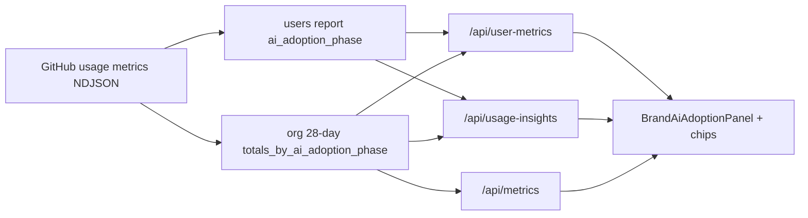

# AI adoption cohorts

New in the [Copilot usage metrics API](https://github.blog/changelog/2026-05-29-copilot-usage-metrics-api-adds-cohorts-for-ai-adoption/) (May 2026). **Copilot Metrics Viewer** can surface it on relevant tabs — **hidden by default**.

## Show / hide (`NUXT_PUBLIC_SHOW_AI_ADOPTION_COHORTS`)

| Value | Behavior |
|-------|----------|
| **Unset / `false`** (default) | No cohort panel, no adoption phase chip in the user dialog, no adoption leaderboard notes |
| **`true`** | **AI adoption cohorts** panel, chips, and related table hints |

```bash
# Turn cohort UI back on (e.g. when using CLI, cloud agent, or code review):
NUXT_PUBLIC_SHOW_AI_ADOPTION_COHORTS=true
```

Restart `npm run dev` or redeploy after changing.

:::tip IDE-only Copilot
If you only use Copilot in the IDE, leave this `false`. Usage patterns and per-user metrics are usually enough. When you enable cohorts, consider `NUXT_PUBLIC_ADOPTION_IDE_ONLY=true` (below).
:::

## Why it exists

Active-user counts show *how many* developers use Copilot. Adoption cohorts answer *how* they use it:

- Mostly code completion, or already on agents?
- How many users are **agent-first** vs **multi-agent**?
- Do interaction, acceptance, or PR averages differ by phase?

GitHub assigns each **engaged** user to one phase (0–3) based on which Copilot surfaces they used on **at least two days** in a rolling **28-day** window. Org/enterprise reports add **per-phase averages** (not sums).

## How GitHub defines phases

| Phase | In-app label | Criterion (per GitHub) |
|-------|----------------|-------------------------|
| **0** | No cohort | Did not meet engagement criteria for any phase |
| **1** | Code first | Code completion and/or **IDE agent mode** |
| **2** | Agent first | **One** GitHub-based agent surface: cloud agent, code review, or CLI |
| **3** | Multi-agent | **Two or more** agent surfaces, or the **GitHub Copilot app** |

### IDE-only mode (`NUXT_PUBLIC_ADOPTION_IDE_ONLY=true`)

Applies only when `NUXT_PUBLIC_SHOW_AI_ADOPTION_COHORTS=true`.

When your org **only** uses Copilot in the IDE (no CLI, cloud agent, code review, etc.), set:

```bash
NUXT_PUBLIC_ADOPTION_IDE_ONLY=true
```

Then the dashboard:

- Shows only **No cohort** and **Code first** in the adoption panel (hides Agent first / Multi-agent cards).
- Updates tooltips and column hints so agent ladders are not mentioned.
- If GitHub still labels a user as phase 2/3, the table shows **N/A** instead of an agent chip.

Default: `false` (all four phases visible).

### `version` field

`ai_adoption_phase` includes `version` (e.g. `v1`) so classification logic can evolve without losing historical context. The dashboard shows the version in the user detail dialog.

### Averages vs sums

`totals_by_ai_adoption_phase` reports **per-user averages within each phase**, not org-wide totals.

## What is Code first?

**Code first** (phase 1) is GitHub’s adoption **label**, not a generic “code-first” slogan. A user is in this phase if they were **engaged on at least two days** in the rolling 28-day window with:

- **Code completion** in the IDE, and/or  
- **IDE agent mode**  

and did **not** qualify for phase 2 or 3.

In practice: they mainly use Copilot **inside the editor** for writing code, and have not yet moved to consistent **GitHub-hosted agent** usage (cloud agent, code review, CLI) or multiple agents. In the app, **hover the “Code first” chip** for this explanation.

## What the dashboard shows

### 1. AI adoption cohorts panel (`BrandAiAdoptionPanel`)

Shown on:

- **Organization**
- **Users**
- **Usage & billing**
- **Usage insights**


| UI part | Description |
|---------|-------------|
| **4 KPI cards** | Engaged users (`total_engaged_users`) per phase 0–3 |
| **Bar chart** | Same counts by phase (phase 0 only if it has engaged users) |
| **Cohort averages table** | Per-phase averages — see mapping table below |

The panel is **hidden** when no phase has engaged users (no cohort data in the report).

### 2. AI adoption phase column


| Location | Column | Key |
|----------|--------|-----|
| Users | AI adoption phase | `ai_adoption_phase` |
| Usage & billing leaderboard | AI adoption phase | `ai_adoption_phase` |

Display: colored chip (`BrandAiAdoptionPhaseChip`) — default (0), primary (1), info (2), warning (3).

### 3. User usage detail dialog


Open from **Usage & billing** → **Usage** (or click the user row).

- Phase chip + **Classification version** (e.g. `v1`)

## API field mapping → dashboard

### User level (`users-1-day` / `users-28-day`)

```json
"ai_adoption_phase": { "phase": 1, "version": "v1" }
```

| Capability | Dashboard status |
|--------------|------------------|
| Read `ai_adoption_phase` from NDJSON | ✅ |
| Numeric or string `phase` (`code_first`, `multi_agent`, …) | ✅ |
| Chip + sortable Users column | ✅ |
| Field visible in API response raw JSON | ✅ |
| Column in legacy metrics CSV export | ❌ not implemented |

### Org / Enterprise level (`organization-28-day/latest`, etc.)

`totals_by_ai_adoption_phase[]`:

| API field (example) | Dashboard table column | Status |
|---------------------|------------------------|--------|
| `phase`, `version` | Phase (chip) | ✅ |
| `total_engaged_users` | Engaged users + KPIs + chart | ✅ |
| `user_initiated_interaction_count_avg` | Avg interactions | ✅ |
| `code_generation_activity_count_avg` | Avg generations | ✅ |
| `code_acceptance_activity_count_avg` | Avg acceptances | ✅ |
| `loc_added_sum_avg` | Avg LOC added | ✅ |
| `loc_deleted_sum_avg` | Avg LOC deleted | ✅ |
| `pull_requests.total_created_avg` | Avg PRs created | ✅ |
| `pull_requests.total_merged_avg` | Avg PRs merged | ✅ |
| `pull_requests.total_reviewed_avg` | Avg PRs reviewed | ✅ |
| `pull_requests.median_minutes_to_merge_avg` | Avg median min to merge | ✅ |

Parser: `shared/utils/ai-adoption-phase.ts` (alternate key names supported).

### Fallback mode

If the org **28-day** report has no `totals_by_ai_adoption_phase`:

- **Users** / **Usage insights** build the panel from **user counts** by `ai_adoption_phase`.
- **Cohort averages** show `—` until GitHub returns the org array.

On **Organization** (`/api/metrics`) there is no user list—only org rollup; without the org array the panel does not appear.

## Server data flow



| Endpoint | Cohort source |
|----------|----------------|
| `GET /api/metrics` | `fetch28DayAdoptionPhases` → org rollup only |
| `GET /api/user-metrics` | org rollup; if empty → `buildAdoptionPhaseView([], users)` |
| `GET /api/usage-insights` | same + users for leaderboard |

## User filter on Usage & billing

When filtering to one user, the panel reflects **that user’s phase count**, not full org averages.

## Known limitations

| Topic | Status |
|-------|--------|
| **Team scope** on `/api/user-metrics` | Not supported (422) — cohorts are org/enterprise level |
| **GitHub teams filter** on reports | Viewer does not pass team params to adoption rollup; future enhancement |
| **Phase progression over time** (1→3) | Not implemented — 28-day snapshot only |
| **CSV export** from API response tab | Field in raw JSON; no dedicated column in legacy metrics CSV |
| **Copilot Chat / Seat analysis** | No cohort panel (different reports) |

## Access requirements

Enterprise admin or organization owner with **Copilot usage metrics** REST API access (same as other usage reports). See [Scopes](../../reference/scopes).

## Related code

| File | Role |
|------|------|
| `shared/utils/ai-adoption-phase.ts` | Parse, map, fallback |
| `shared/utils/usage-metrics-report.ts` | `fetch28DayRollupRecord`, `fetch28DayAdoptionPhases` |
| `app/components/BrandAiAdoptionPanel.vue` | KPI + chart + table |
| `app/components/BrandAiAdoptionPhaseChip.vue` | Phase chip |
| `tests/ai-adoption-phase.spec.ts` | Unit tests |

## Related pages

- [Organization — KPIs and charts](./organization-metrics)
- [Users table columns](./users-table-columns)
- [User usage detail dialog](./user-usage-detail-dialog)
- [Recent changes](../../reference/recent-features)
