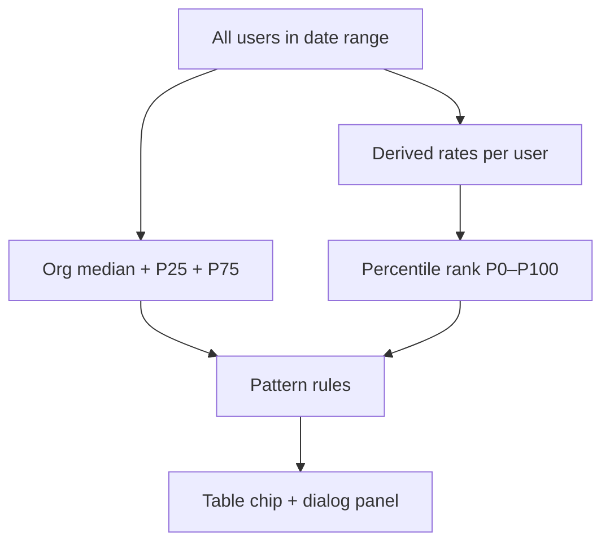

# Usage patterns

**Usage patterns** are heuristic labels that help you understand *how* a developer uses Copilot — not just *how much*. They are computed **in the dashboard** from Copilot metrics (interactions, generations, acceptances, lines added) **compared to other users** in the selected date range.

:::caution Not a GitHub API field
Usage patterns are **not** part of GitHub’s API. They are for coaching, guidance, and internal conversation — **not** performance ratings or HR decisions.
:::

## Where to see them

| Location | What you get |
|----------|----------------|
| **Users** — **Top 5 effective Copilot users** | Up to 5 KPI cards: login, **effectiveness score**, activity, pattern — [Users tab](./users) |
| **Users** — **Usage pattern** column | Colored chip per user |
| **Usage & billing** — **Usage pattern** column | Same chip in the leaderboard |
| **Usage dialog** (**Usage** button) | Full panel: pattern, engagement score, derived rates, formulas, org percentiles |

Hover the table chip for a short hint, **confidence** level, and **engagement score**. Open the **Usage** dialog for the full breakdown.

See also: [User usage detail dialog](./ui-reference/user-usage-detail-dialog) · [Users table columns](./ui-reference/users-table-columns)

## How it is calculated (summary)

1. **Cohort** — every user in the report for the selected range (not only the filtered row).
2. **Raw counts** — interactions, generations, acceptances, LoC added from the metrics report.
3. **Derived rates** — ratios between counts (see table below).
4. **Org percentiles** — P25, median (P50), P75 for each metric in the cohort.
5. **User percentile** — “`P{n}` vs org”: share of cohort with a **lower** value (0 = lowest, 100 = highest).
6. **Pattern classification** — rules comparing to P25/P50/P75 (see [pattern list](#pattern-list)).
7. **Engagement score** — 0–100: user activity vs the most active user in the cohort.
8. **Confidence** — low / medium / high based on total activity (less data → lower confidence).

## Derived rates and formulas

| Metric | Formula | Meaning |
|--------|---------|---------|
| **Acceptance rate** | `acceptances ÷ generations × 100` | Share of suggestions kept (0% if no generations) |
| **Generations per interaction** | `generations ÷ interactions` | Generations per interaction “round” |
| **LoC per acceptance** | `lines added ÷ acceptances` | Average code volume per acceptance |
| **LoC per interaction** | `lines added ÷ interactions` | LoC “efficiency” per interaction |
| **LoC per generation** | `lines added ÷ generations` | Average LoC per generation |

In the **Usage** dialog, each row shows: **your value**, **org median**, **percentile vs org**, and the **formula**.

## What each label means (plain language)

The table below explains **what you see on screen** in everyday terms.  
“High” / “low” always means **vs other users in your org** in the same date range — not a fixed global number.

| Label (English UI) | Hebrew UI | In simple terms | What it is **not** |
|--------------------|-----------|-----------------|---------------------|
| **Insufficient data** | נתונים לא מספיקים | Too little usage yet — the app won’t classify confidently | Not “bad developer” |
| **Underuse** | שימוש חלש | Barely uses Copilot (seat may be idle) | Worth checking training / blockers |
| **Light user** | משתמש קל | Uses Copilot a bit, but less than most peers | Not the same as underuse — there is some activity |
| **Selective accepter** | מקבל סלקטיבי | Often says “yes” to suggestions, but **small total volume** — picky keeper | Not refusing Copilot |
| **Completion-first** | השלמת קוד תחילה | Mostly **inline completions** (Tab), less chat | Not “doesn’t use Copilot” |
| **Active reviewer** | סוקר פעיל | Copilot suggests a lot; they **look at a lot** and **keep little** | Maybe suggestions don’t fit their style |
| **Efficient adopter** | מאמץ יעיל | Keeps a high share of suggestions with **healthy** volume — good fit | Not “most lines of code” |
| **Volume adopter** | אימוץ נרחב | **Keeps many** suggestions **and** adds **many lines** — among the heaviest users in the org | **Not** code quality; **not** “best developer” |
| **High try, low keep** | הרבה ניסיונות, מעט שמירה | Copilot generates a lot; they **try a lot** but **keep little** | Different from volume adopter — there, keeps are high too |
| **Power user** | משתמש כוח | Heavy use **plus** Chat or Agent — multiple Copilot surfaces | Champion candidate, not a performance grade |
| **Balanced** | מאוזן | Typical mix **for your org** — middle of the pack | Not “boring average” — just no extreme pattern |

:::info Volume adopter / אימוץ נרחב
Hebrew UI label **אימוץ נרחב** replaces the older confusing **מאמץ בנפח**. Meaning: **heavy Copilot adoption by volume** — many accepts and many lines added, above most peers in the period.
:::

## Pattern list (technical)

| Pattern | When it applies (summary) | Practical meaning |
|---------|----------------------------|-------------------|
| **Insufficient data** | Very low activity and LoC | Cannot classify reliably — wait for more usage |
| **Underuse** | Interactions, generations, LoC below P25 | Seat may be idle — check training / blockers |
| **Light user** | Activity below org medians | Some usage, below typical volume |
| **Selective accepter** | High acceptance (≥ P75), modest volume | Accepts fewer, well-targeted suggestions |
| **Completion-first** | High LoC per interaction, less chat | Inline completions dominate |
| **Active reviewer** | Many interactions, low acceptance | Explores many suggestions before keeping |
| **Efficient adopter** | High acceptance + solid generation volume | Good fit between suggestions and workflow |
| **Volume adopter** | LoC above P75 and acceptances ≥ median | Many keeps and many lines — heavy adoption by volume |
| **High try, low keep** | High generations & LoC, acceptance ≤ P25 | Many trials, few keeps — guidance or model fit |
| **Power user** | High generations & LoC + Agent or Chat | Deep Copilot + agent surfaces |
| **Balanced** | Default — near org medians | Steady, typical usage mix |

The first matching rule wins (priority order in code). If none match → **Balanced**.

## Metric combinations — how to read them

Common combinations managers ask about. These are **interpretation guides**, not separate classification rules:

| What you see | Possible reading | Coaching questions |
|--------------|------------------|-------------------|
| **High LoC + low interactions** | Inline completions / large accepts without much “chat” | Mostly in-editor work? Could chat help on larger tasks? |
| **High interactions + low acceptance** | **Active reviewer** — explores a lot, keeps little | Suggestions off-style? Need `.github/copilot-instructions`? |
| **High generations + low acceptance** | **High try, low keep** | Model / context / prompts — what doesn’t fit? |
| **High acceptance + low LoC** | **Selective accepter** | Healthy sometimes; ensure they’re not missing opportunities |
| **High LoC + high acceptances** | **Volume adopter** | Share practices; watch code quality, not just volume |
| **Low on all metrics** | **Underuse** or **Light user** | Assigned seat unused? Technical blockers? |
| **Agent/Chat yes + power pattern** | Multi-surface usage | Internal champion candidate |

:::tip Relative to cohort, not absolute targets
“High” and “low” are always **vs your org** in the same date range.
:::

## Effectiveness score vs engagement score

| Metric | Where shown | Meaning |
|--------|-------------|---------|
| **Effectiveness score** | **Top 5** KPI cards on Users | Ranks “effective Copilot use”: pattern + acceptance percentiles + volume multiplier; excludes underuse / high-try-low-keep |
| **Engagement score** | Usage dialog, pattern chip hover | Relative activity volume: `(interactions + generations + acceptances) ÷ cohort max × 100` |

You can have **high engagement** but not appear in the top five — e.g. **High try, low keep**. **Efficient adopter** with moderate volume may rank high on effectiveness without being the heaviest user.

Code: `shared/utils/copilot-quality-score.ts` · `pickTopUsersByCopilotQuality` · tests: `tests/copilot-quality-score.spec.ts`.

## Engagement score and confidence

| Component | Meaning |
|-----------|---------|
| **Engagement score (0–100)** | `(interactions + generations + acceptances) ÷ cohort max × 100` |
| **High confidence** | Activity sum ≥ 25 |
| **Medium confidence** | Activity sum 10–24 |
| **Low confidence** | Activity sum &lt; 10 |

With fewer events, pattern labels are less reliable — watch **Insufficient data** and **Low confidence**.

## Relation to AI adoption phase

[AI adoption cohorts](./ui-reference/ai-adoption-cohorts) (Code first, Agent first, …) come **from GitHub** and describe *which Copilot surfaces* the user engages with.

**Usage pattern** describes *how* activity looks (acceptance ratio, volume, style). Use both together:

| Adoption phase | Usage pattern | Insight |
|----------------|---------------|---------|
| Code first | השלמת קוד תחילה (Completion-first) | Consistent in-editor work |
| Code first | Active reviewer | Uses Copilot but keeps little — coaching on acceptance |
| Agent first | Power user | Advanced adoption + volume |

## Filters and date range

- **Global date range** — cohort and percentiles use **all users** in that range.
- **Filter to one user** — shows one row; percentiles still compare to the **full cohort**.
- **Users — Filter by day** — single-day report; cohort is users for that day.

## Important limitations

| Topic | Notes |
|-------|--------|
| Not GitHub API | Not in GitHub’s raw JSON export |
| Heuristic | Fixed rules — not ML or “code quality score” |
| Cohort size | Percentiles less stable with very few users |
| LoC ≠ quality | Many lines does not mean good code |
| No PR metrics | PR stats live in adoption cohorts, not usage patterns |
| i18n | Labels translated (Hebrew / English) — same logic |

## Recommended use for Copilot admins

1. **Idle seats** — **Underuse** + low engagement score.
2. **Acceptance coaching** — **Active reviewer** / **High try, low keep** — context, model, repo instructions.
3. **Champions** — **Power user** / **Efficient adopter** / **Volume adopter** (אימוץ נרחב) — share with the team; emphasize review quality, not only volume.
4. **Do not use for ranking** — patterns for questions and trends, not individual KPIs or bonuses.

## Code (for developers)

| File | Role |
|------|------|
| `shared/utils/usage-pattern-insights.ts` | Rates, percentiles, classification |
| `shared/types/usage-pattern.ts` | Types |
| `app/composables/useUsagePatternInsights.ts` | Vue integration |
| `app/components/BrandUsagePatternChip.vue` | Table chip |
| `app/components/UserUsageInsightPanel.vue` | Dialog panel |
| `app/components/BrandUsersTopKpiRow.vue` | Top 5 by effectiveness (Users) |
| `shared/utils/users-top-kpi.ts` | `pickTopUsersByCopilotQuality` / `pickTopUsersByEngagement` |
| `shared/utils/copilot-quality-score.ts` | Effectiveness score 0–100 |
| `tests/usage-pattern-insights.spec.ts` | Unit tests |
| `tests/users-top-kpi.spec.ts` | Top-N unit tests |
| `tests/copilot-quality-score.spec.ts` | Effectiveness score tests |

## Links

- [Users](./users)
- [Usage & billing](./usage-billing)
- [User usage detail dialog](./ui-reference/user-usage-detail-dialog)
- [AI adoption cohorts](./ui-reference/ai-adoption-cohorts)
- [Recent features](../reference/recent-features)
